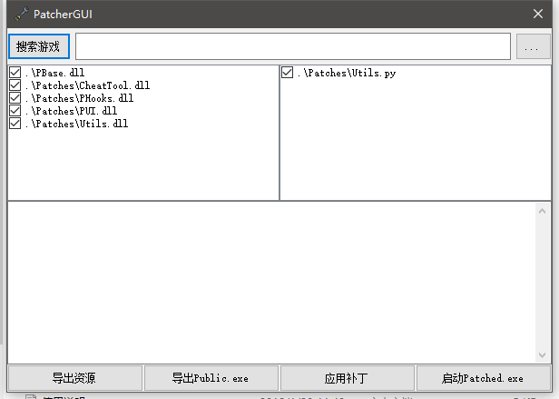

# Terraria Patcher

## 简述
Terraria Patcher用于给Terraria打补丁，实现一些功能，而不需要将游戏反编译得到源码。
  
## 如何使用
如图:  
  
正版泰拉瑞亚玩家，点击搜索游戏会自动搜索到Terraria.exe  
而盗版玩家点击右边省略号手动选择Terraria.exe  
补丁开发:  
>点击导出资源会将Terraria引用的几个DLL导出  
>导出Public.exe，得到一个方法、字段之类公开化的游戏  
>新建项目，引用Public.exe，实现功能，构建，得到补丁(.dll)，放入Paches文件夹  
>重新打开Patcher，可看到补丁在补丁备选区出现  
>选择游戏，点击应用补丁，会导出Patched.exe，即打好补丁的游戏  
非开发者只需要获得补丁、应用补丁即可  
  
## 项目结构
>Patcher:打补丁的逻辑实现  
>PatcherGUI:界面实现  
>ILFactory:提供了一些简单操作，供Python插件调用，对函数做处理  
>PBase:基补丁，大部分补丁都需要引用此补丁，PBase.dll和其他补丁不同，不在Patches目录下，而与Patcher同级  
>Mod:真名Utils，一个简单的补丁，用于取消Steam验证和修复了游戏中聊天框输入中文在输入法状态下退格会删除已输入内容的问题  
>PHooks:提供了一些简单的钩子函数  
>PUI:为Terraria实现的一套界面库，实现得较为粗糙，这个插件曾独立开源  
>CheatTool:使用PUI、PHooks实现的一个补丁，提供了一些作弊功能  
>ScheMaker:为CheatTool开发的工具，用于将图片(png)转化为.sche文件，以便CheatTool将其作为方块加载到游戏  
>Tindows:已停止开发，曾想在Terraria中开发一个操作系统界面  

## 开发者(引用自使用说明，有删改)
>补丁的开发使用基于.Net环境的语言(推荐C#)和IronPython  
>前者主要负责补丁的逻辑，通常是对游戏原有的代码进行删改。后者负责一些比较细小的定位修改  
>C#部分:  
>>打开Patcher，选择好游戏，导出Public.exe。  
>>新建工程，引用PBase.dll、Public.exe，然后就可以开始进行开发了。  
>>PBase.dll同样是一个补丁，但是本身没有功能，在Patcher中默认选中并且无法反选。  
>>PBase.dll的作用是提供描述类，给其他的补丁引用以让Patcher可以识别。  
>>Public.exe的方法字段已被公开化，开发者可以使用里面原来的私有方法。  
>>打补丁的过程中，Patcher会将游戏公开化，然后将所有补丁和公开化的游戏合并在一起得到半成品。  
>>紧接着Patcher会扫描所有的类，将所有被PBase所描述的类、方法处理。  
>>最后执行所有的Python补丁(不确定顺序)，对方法进行处理。  
>>PPatch:用于描述一个类，确定对这个类的操作  
>>>原型  
>>>PPatch(PPatchOption option, string Namespace, string TypeName, string Description, bool moveStaticVarible = false, bool moveDynamicVarible = false, bool moveAnonymousType = false)  
>>>option取值:Merge和Move  
>>>>Merge代表将此类与目标类合并，只有在此时，moveStaticVarible及后面的参数才有意义  
>>>>Move代表将此类移往目标处，如果已经存在，会发生冲突。这种标识下，只有前三个参数有意义  
>>>Namespace是目标命名空间  
>>>TypeName是目标类名称  
>>>最后三个参数在option为Merge时起效，分别指示了合并时是否移动静态字段，移动变量，移动匿名类  
>>  
>>PMethod:用于描述一个方法，包括构造方法和静态构造方法，但是这个描述只在PPatch为Merge的类中方法起效  
>>>原型  
>>>PMethod(PMethodOption option, string MethodName, string Description, bool willCheck = false)  
>>>option取值:Move、Replace以及Hook  
>>>>Move表示直接把方法移动到目标处而不进行操作  
>>>>Replace表示替换掉目标方法  
>>>>Hook表示将这个方法移入目标类，且让目标方法运行完毕之后调用这个方法  
>>>需要十分注意，PMethod为目标方法名称，而具体的命名空间和类名由当前类的PPatch指定  
>>>willCheck参数已弃用  
>>  
>>PDependence:用于描述依赖，可以叠加多个，无法满足依赖时Patcher会根据指示进行处理  
>>>原型  
>>>PDependence(PDependenceOption option, bool isClass, string name)  
>>>option取值:Error、Warning和Skip  
>>>>Error表示在依赖无法满足时发生错误并且停止操作  
>>>>Warning表示警告，但是不会停止操作，该方法仍会被处理  
>>>>Skip表示无法满足依赖时警告，并且跳过当前方法，方法不会被处理  
>>>参数isClass表示所依赖的是否是类，不是类则是方法  
>>>name是依赖的完全限定名称，即包括命名空间、类名、(方法名)在内的完整名称  
  
>Python:  
>>Patcher使用IronPyhon运行Python，所以可以导入.Net的DLL  
>>已经准备了ILFactory.dll，有一套的IL指令处理库  
>>可以参考Utils.py  
>需要注意的东西:  
>>1.需要替换原方法的内容时，最好的方式是新建一个类继承原类，然后重写你要替换的方法，接着使用PMethod和Replace标识将方法替换  
>>2.PMethod所提供的Hook方式只能在方法末尾进行Hook，这是为防止在前面插入指令而影响指令索引，提高兼容性  
>>3.有一种更好的Hook方式，那就是用新方法替换原方法，在头尾加入调用Hook的代码  
>>4.如果你写的补丁某个类中有匿名方法，并且该类的PPatch标识为Merge，那么除非你能确定这个匿名方法不会被调用，否则moveAnonymousType参数必须为true  
>>5.静态构造方法写上一些东西，游戏在一开始运行的时候就会执行，这可以用来初始化一些钩子之类的东西  
>>6.不要试图去搞一个原本就是继承而来的方法  